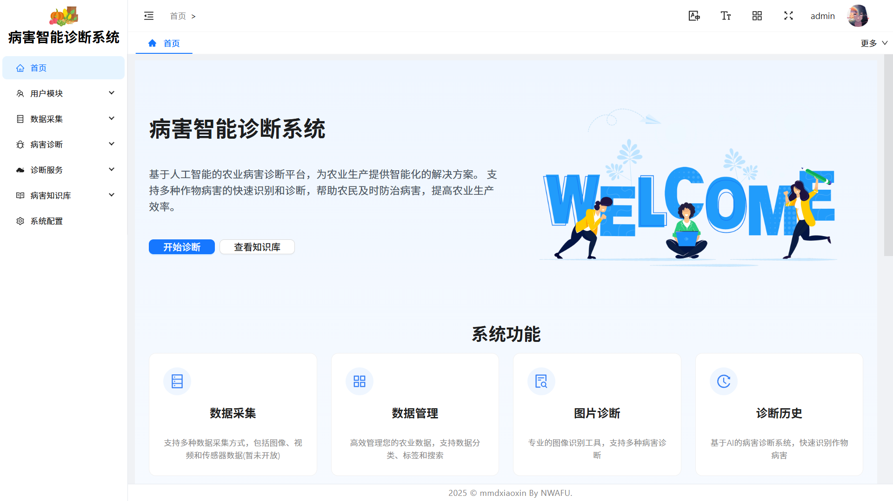
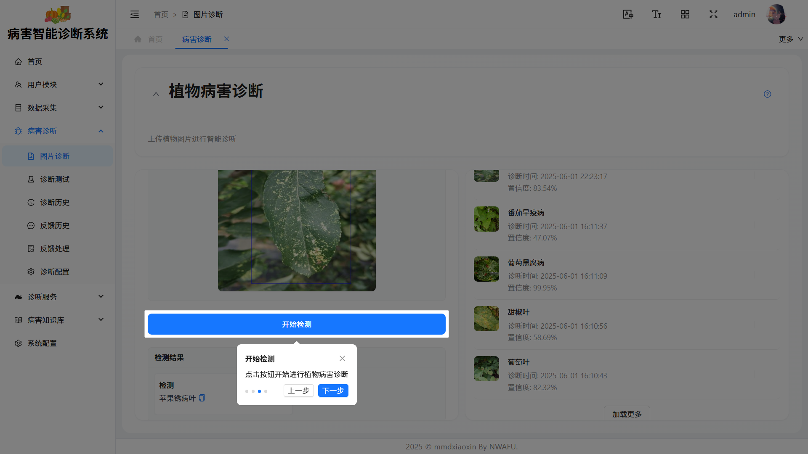

# 🌾 农业病害智能诊断系统

<div align="center">

[](https://reactjs.org/)
[](https://www.typescriptlang.org/)
[](https://vitejs.dev/)
[](https://ant.design/)
[](LICENSE)

基于 React + TypeScript + Vite 构建的现代化农业病害诊断平台，为农业生产提供智能化的解决方案。

[在线演示](https://your-demo-url.com) · [问题反馈](https://github.com/mmdxiaoxin/agricultural-diagnostic-web/issues) · [更新日志](CHANGELOG.md)

</div>

## 📸 项目预览

<div align="center">
  
  <br/>
  <em>系统仪表盘</em>
</div>

<div align="center">
  
  <br/>
  <em>病害诊断界面</em>
</div>

## ✨ 系统特点

<div align="center">

|                         🧠 智能诊断                          |                        📚 知识库                         |                     📊 数据管理                      |
| :----------------------------------------------------------: | :------------------------------------------------------: | :--------------------------------------------------: |
| 基于深度学习算法，快速准确地识别作物病害，提供专业的诊断建议 | 丰富的病害知识库，包含详细的病害信息、防治方法和用药建议 | 完善的数据管理系统，支持数据采集、存储、分析和可视化 |

</div>

## 🚀 主要功能

<div align="center">

| 功能模块          | 说明                                             |
| :---------------- | :----------------------------------------------- |
| 🔍 **数据采集**   | 支持多种数据采集方式，包括图像、视频和传感器数据 |
| 📁 **数据管理**   | 高效管理农业数据，支持数据分类、标签和搜索       |
| 🏥 **病害诊断**   | 基于 AI 的病害诊断系统，快速识别作物病害         |
| 🖼️ **图片分析**   | 专业的图像分析工具，支持多种图像处理功能         |
| 🤖 **模型管理**   | 管理 AI 模型，支持模型训练、评估和部署           |
| 📖 **病害知识库** | 丰富的病害知识库，包含详细的病害信息和防治方法   |
| ⚙️ **系统配置**   | 系统配置和管理，包括用户权限、系统参数等         |
| 👥 **用户管理**   | 用户账户管理，支持用户注册、权限分配等           |
| 🔧 **诊断服务**   | 管理诊断服务，配置诊断服务调用                   |

</div>

## 🛠️ 技术栈

### 核心框架

- ⚛️ [React 18](https://reactjs.org/) - 用于构建用户界面的 JavaScript 库
- 📘 [TypeScript](https://www.typescriptlang.org/) - JavaScript 的超集，添加了静态类型
- ⚡️ [Vite](https://vitejs.dev/) - 下一代前端构建工具

### UI 组件与样式

- 🎨 [Ant Design 5](https://ant.design/) - 企业级 UI 设计语言和 React UI 库
- 🎭 [Framer Motion](https://www.framer.com/motion/) - 强大的动画库
- 🎯 [TailwindCSS](https://tailwindcss.com/) - 实用优先的 CSS 框架
- 🎨 [Sass](https://sass-lang.com/) - CSS 预处理器

### 状态管理与路由

- 🔄 [Redux Toolkit](https://redux-toolkit.js.org/) - Redux 官方推荐的状态管理工具
- 🔄 [React Redux](https://react-redux.js.org/) - React 的 Redux 绑定库
- 🔄 [Redux Persist](https://github.com/rt2zz/redux-persist) - Redux 状态持久化
- 🛣️ [React Router](https://reactrouter.com/) - React 的路由库

### 工具与工具库

- 📊 [ECharts](https://echarts.apache.org/) - 强大的图表库
- 📝 [Monaco Editor](https://microsoft.github.io/monaco-editor/) - 代码编辑器
- 📄 [html2canvas](https://html2canvas.hertzen.com/) - HTML 转 Canvas
- 📄 [jsPDF](https://parall.ax/products/jspdf) - PDF 生成库
- 🔍 [Lodash](https://lodash.com/) - 实用工具库
- 🔄 [Axios](https://axios-http.com/) - HTTP 客户端
- 📅 [Day.js](https://day.js.org/) - 日期处理库

### 开发工具

- 🛠️ [ESLint](https://eslint.org/) - 代码检查工具
- 💅 [Prettier](https://prettier.io/) - 代码格式化工具
- 📦 [PostCSS](https://postcss.org/) - CSS 转换工具
- 🖼️ [Vite Plugin Imagemin](https://github.com/anncwb/vite-plugin-imagemin) - 图片压缩插件
- 📦 [Vite Plugin Compression](https://github.com/anncwb/vite-plugin-compression) - Gzip 压缩插件

## 🌐 浏览器兼容性

<div align="center">

| Chrome | Firefox | Safari | Edge  |  iOS  | Android |
| :----: | :-----: | :----: | :---: | :---: | :-----: |
| >= 60  |  >= 60  | >= 12  | >= 79 | >= 12 |  >= 7   |

</div>

具体支持范围：

- 市场份额大于 1% 的浏览器
- 最新两个版本
- 不支持已停止维护的浏览器
- 不支持 IE 11
- 不支持 Opera Mini

项目使用 `@vitejs/plugin-legacy` 插件自动生成兼容性代码，确保在较旧的浏览器中也能正常运行。

## 🚀 开始使用

### 环境要求

- Node.js >= 16.0.0
- pnpm >= 8.0.0
- Nginx >= 1.18.0 (生产环境)

### 开发环境配置

1. 安装 VSCode 插件

   - ESLint
   - Prettier
   - TypeScript Vue Plugin (Volar)
   - Tailwind CSS IntelliSense
   - GitLens

2. 配置 VSCode 设置

```json
{
	"editor.formatOnSave": true,
	"editor.defaultFormatter": "esbenp.prettier-vscode",
	"editor.codeActionsOnSave": {
		"source.fixAll.eslint": true
	},
	"typescript.tsdk": "node_modules/typescript/lib"
}
```

3. 配置 Git 提交规范

```bash
# 安装 husky
pnpm add -D husky lint-staged @commitlint/cli @commitlint/config-conventional

# 初始化 husky
npx husky install

# 添加 commit-msg hook
npx husky add .husky/commit-msg 'npx --no -- commitlint --edit $1'
```

4. 配置环境变量

```bash
# .env.development
VITE_APP_TITLE=农业病害智能诊断系统
VITE_APP_API_BASE_URL=http://localhost:3000
VITE_APP_UPLOAD_URL=http://localhost:3000/upload

# .env.production
VITE_APP_TITLE=农业病害智能诊断系统
VITE_APP_API_BASE_URL=https://api.your-domain.com
VITE_APP_UPLOAD_URL=https://api.your-domain.com/upload
```

### 安装与运行

1. 克隆项目

```bash
git clone https://github.com/mmdxiaoxin/agricultural-diagnostic-web.git
```

2. 安装依赖

```bash
pnpm install
```

3. 启动开发服务器

```bash
pnpm dev
```

4. 构建生产版本

```bash
pnpm build
```

5. 预览生产版本

```bash
pnpm preview
```

6. 代码检查

```bash
pnpm lint
```

7. 代码格式化

```bash
pnpm prettier
```

## 📦 生产环境部署

### 1. 构建项目

```bash
# 安装依赖
pnpm install

# 构建生产版本
pnpm build
```

构建完成后，会在项目根目录生成 `dist` 文件夹，包含所有静态资源。

### 2. Nginx 配置

1. 安装 Nginx（如果尚未安装）

```bash
# Ubuntu/Debian
sudo apt update
sudo apt install nginx

# CentOS
sudo yum install nginx
```

2. 创建 Nginx 配置文件

```bash
sudo vim /etc/nginx/conf.d/agricultural-diagnostic.conf
```

3. 添加以下配置内容：

项目提供了多个 Nginx 配置示例，位于 `src/assets/nginx` 目录下：

- `http.conf` - 基础 HTTP 配置（仅 HTTP 1.1）
- `https2.conf` - 基础 HTTPS 配置
- `https3.conf` - HTTP/3 配置
- `https2-withBrotli.conf` - 支持 Brotli 压缩的 HTTPS 配置
- `https3-withBrotli.conf` - 支持 Brotli 压缩的 HTTP/3 配置

您可以根据需求选择合适的配置文件作为参考。以下是一个基础配置示例：

```nginx
server {
    listen 80;
    root /path/to/your/dist;      # 替换为您的项目 dist 目录的绝对路径
    index index.html;

    # Gzip 压缩配置
    gzip on;
    gzip_min_length 1k;
    gzip_comp_level 6;
    gzip_types text/plain text/css text/javascript application/json application/javascript application/x-javascript application/xml;
    gzip_vary on;
    gzip_disable "MSIE [1-6]\.";

    # 安全相关配置
    add_header X-Frame-Options "SAMEORIGIN";
    add_header X-XSS-Protection "1; mode=block";
    add_header X-Content-Type-Options "nosniff";

    # 缓存配置
    location ~* \.(jpg|jpeg|png|gif|ico|css|js)$ {
        expires 7d;
        add_header Cache-Control "public, no-transform";
    }

    # 主应用配置
    location / {
        try_files $uri $uri/ /index.html;
        add_header Cache-Control "no-cache, no-store, must-revalidate";
    }

    # API 代理配置（如果需要）
    location /api/ {
        proxy_pass http://your-backend-server:port/;
        proxy_http_version 1.1;
        proxy_set_header Upgrade $http_upgrade;
        proxy_set_header Connection 'upgrade';
        proxy_set_header Host $host;
        proxy_cache_bypass $http_upgrade;
    }
}
```

4. 检查 Nginx 配置是否正确

```bash
sudo nginx -t
```

5. 重启 Nginx 服务

```bash
sudo systemctl restart nginx
```

### 3. SSL 配置（推荐）

1. 安装 Certbot

```bash
# Ubuntu/Debian
sudo apt install certbot python3-certbot-nginx

# CentOS
sudo yum install certbot python3-certbot-nginx
```

2. 获取 SSL 证书

```bash
sudo certbot --nginx -d your-domain.com
```

3. 证书自动续期（Certbot 会自动配置）

### 4. 部署检查清单

- [ ] 确保所有环境变量已正确配置
- [ ] 检查 API 接口地址配置
- [ ] 验证静态资源是否正确加载
- [ ] 测试所有主要功能
- [ ] 检查错误日志
- [ ] 确认 SSL 证书状态
- [ ] 验证缓存策略
- [ ] 测试性能表现

### 5. 监控与维护

1. 日志查看

```bash
# Nginx 访问日志
sudo tail -f /var/log/nginx/access.log

# Nginx 错误日志
sudo tail -f /var/log/nginx/error.log
```

2. 性能监控

```bash
# 查看 Nginx 进程状态
ps aux | grep nginx

# 查看系统资源使用情况
htop
```

3. 定期维护任务

- 定期更新 SSL 证书
- 清理日志文件
- 更新系统包
- 检查磁盘空间
- 备份重要数据

## 📁 项目结构

```
src/
├── assets/        # 静态资源
├── components/    # 公共组件
├── hooks/         # 自定义 Hooks
├── layouts/       # 布局组件
├── routes/        # 路由配置
├── services/      # API 服务
├── store/         # 状态管理
├── types/         # TypeScript 类型定义
├── utils/         # 工具函数
└── views/         # 页面组件
```

## 🤝 贡献指南

欢迎提交 Pull Request 或创建 Issue 来帮助改进项目。

## 📄 许可证

本项目采用 [GNU Affero General Public License v3.0](LICENSE) 许可证。

该许可证要求：

1. 任何修改后的代码必须以相同的许可证发布
2. 如果通过网络提供服务，必须提供源代码
3. 必须保留原始版权声明和许可证
4. 必须包含完整的许可证文本

更多详细信息请查看 [LICENSE](LICENSE) 文件。

## ❓ 常见问题

### 1. 开发环境问题

#### Q: 启动开发服务器时报错

A: 请检查：

- Node.js 版本是否符合要求
- 是否已安装所有依赖
- 端口是否被占用
- 环境变量是否正确配置

#### Q: 热更新不生效

A: 请检查：

- Vite 配置是否正确
- 是否使用了正确的文件扩展名
- 是否有语法错误

### 2. 构建问题

#### Q: 构建失败

A: 请检查：

- 依赖是否完整
- 是否有类型错误
- 是否有语法错误
- 是否有循环依赖

#### Q: 构建后的文件过大

A: 可以：

- 使用 `rollup-plugin-visualizer` 分析打包体积
- 检查是否有重复依赖
- 优化图片资源
- 使用动态导入

### 3. 部署问题

#### Q: 部署后页面空白

A: 请检查：

- Nginx 配置是否正确
- 静态资源路径是否正确
- 是否有跨域问题
- 控制台是否有错误

#### Q: 部署后接口报错

A: 请检查：

- 接口地址是否正确
- 是否有跨域问题
- 服务器防火墙配置
- 网络连接是否正常

## 📈 性能优化

### 1. 构建优化

- 使用 `vite-plugin-compression` 进行 Gzip/Brotli 压缩
- 使用 `vite-plugin-imagemin` 压缩图片资源
- 配置 `build.rollupOptions.output.manualChunks` 进行代码分割
- 使用 `@vitejs/plugin-legacy` 提供浏览器兼容性支持

### 2. 运行时优化

- 使用 React.lazy 和 Suspense 实现组件懒加载
- 使用 useMemo 和 useCallback 优化性能
- 使用虚拟列表优化长列表渲染
- 使用 Web Workers 处理复杂计算

### 3. 缓存优化

- 配置合理的缓存策略
- 使用 Service Worker 实现离线缓存
- 使用 IndexedDB 存储大量数据
- 使用 localStorage 存储用户配置

## 🔐 安全建议

### 1. 前端安全

- 使用 HTTPS
- 实现 CSP 策略
- 防止 XSS 攻击
- 防止 CSRF 攻击
- 敏感数据加密

### 2. 部署安全

- 定期更新依赖
- 配置防火墙
- 使用 WAF
- 限制文件上传
- 配置访问控制

### 3. 数据安全

- 数据加密传输
- 敏感信息脱敏
- 定期数据备份
- 访问日志记录
- 权限精细控制
